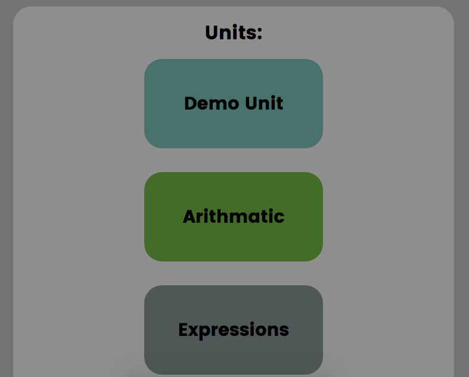
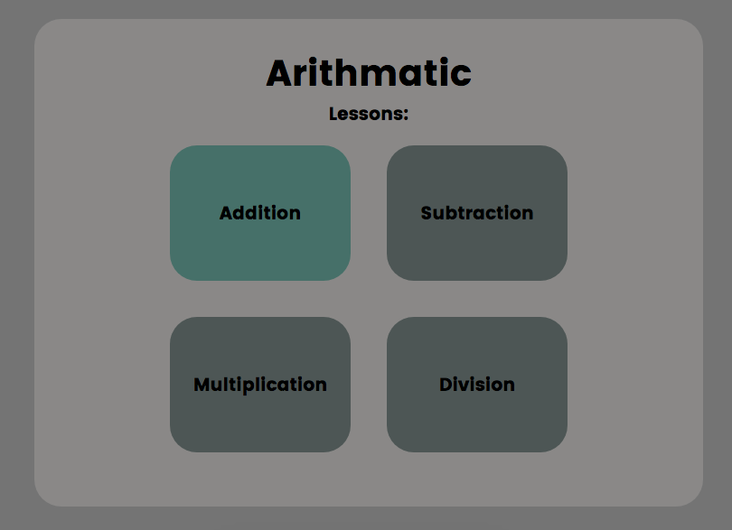
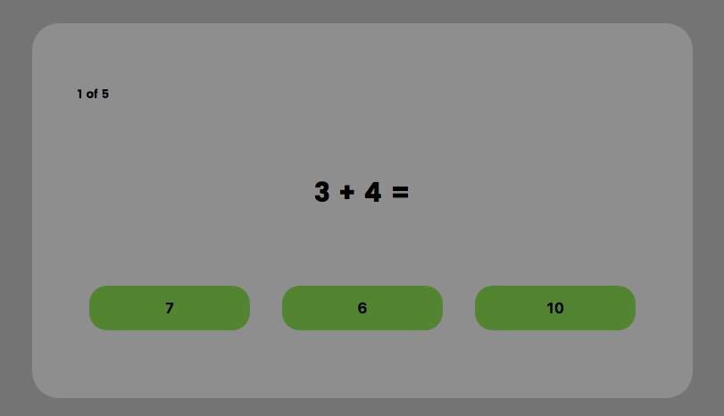
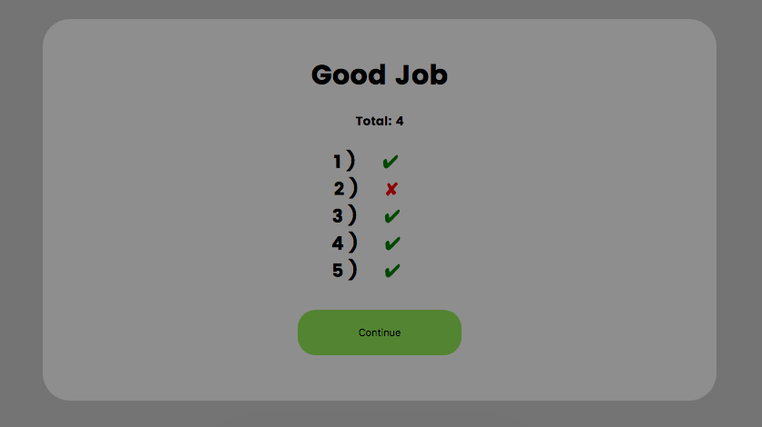

# [MathPath](https://math-path.herokuapp.com)

An Intuitive approach to math practice problems. Modeled after [duolingo](https://duolingo.com), MathPath leads learners through course materials in easy to digest units and lessons that progress in difficulty. The front-end is build in React/Redux and a Rails 5 back-end.

## Featuring

###  A Guided Path Through Math Content
Successfully completing a lesson unlocks the next lesson, and completing all of the lessons in a unit unlocks the next unit.

### A Streamlined and Intuitive User Interface
Easy to understand and styled to be appropriate for all ages.


*The skill tree displays the available units as blue, the current unit is green, and the locked units are gray*


*In the unit view the user can visually see their progress in the color coded lessons that dynamically change on completion.*


*Questions have multiple answers*


*The end of lesson displays results*

## Implementation Highlights

### Sample Normalized State
Normalizing state reduces data redundancy, reducer complexity, and simplifies data retrieval and updates.
```javascript
{
  session: {
    currentUser: {
      id: 1,
      username: 'Guest'
    },
    errors: []
  },
  units: {
    '1': {
      id: 1,
      name: 'Demo Unit'
    },
    '2': {
      id: 2,
      name: 'Arithmetic'
    },
  lessons: {
    '3': {
      id: 3,
      name: 'Addition'
    },
    '4': {
      id: 4,
      name: 'Subtraction'
    },
  questions: {
    '6': {
      id: 6,
      name: '3 + 4 = ',
      answers: {
        '16': {
          id: 16,
          name: '7',
          value: true
        },
        '17': {
          id: 17,
          name: '6',
          value: false
        },
        '18': {
          id: 18,
          name: '10',
          value: false
        }
      }
    },
    '7': {
      id: 7,
      name: '5 + 2 = ',
      answers: {
        '19': {
          id: 19,
          name: '3',
          value: false
        },
        '20': {
          id: 20,
          name: '7',
          value: true
        },
        '21': {
          id: 21,
          name: '8',
          value: false
        }
      }
    }
  },
  currentLesson: {
    lessonId: 3,
    idx: 5,
    keys: [
      6,
      7
    ],
    correct: [
      'false',
      'false'
    ]
  },
  progress: {
    lessonMax: 3,
    unitMax: 2
  }
}
```

## Path Forward
* Add user statistics
* Add Multiple Paths to unlock content
* Add Additional Instructional Content
